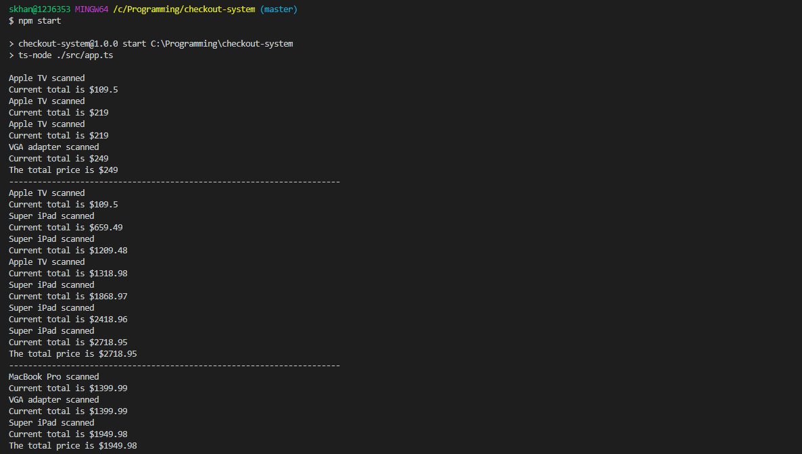

# checkout-system

This project implements a checkoutSystem class which can take in a pricing rules dictionary and apply different pricing models based on the item SKU. 


The project uses the following technologies:
- Backend: NodeJs
- Type Checking: Typescript



## Getting Started

```bash
npm install
npm start
```

There are four methods in the CheckoutSystem class:
```
- scan          - Takes an argument of type Iitems and adds it to the items property and calculate the current total
- total         - Returns the total price
- getItems      - Returns the item count dictionary
- clear         - Sets the items to empty dictionary and totalPrice to 0
```


## Scripts


```
- npm run eslint           - will run the linter checks
- npm test                 - will run all the tests
- npm run coverage         - will generate code coverage reports
- npm run build            - will generate generate .js from the .ts files for production use
- npm run build:watch      - will generate generate .js from the .ts files for production use and watch for changes
- npm start                - will start the robot simulator app
```

## Project Structure

### Overall Structure

1. The `test` directory contains all the unit and integration tests.
2. The `src` directory contains the all the source code including the app.ts file.
3. The `dist` directory contains all compiled js files.

## Development


This project uses ESLint to detect suspicious code in JavaScript files.
Visit http://eslint.org for details.

### Testing

This project uses jest.
Visit https://jestjs.io/ for details.

To execute tests:

```bash
npm test
```

To calculate coverage:

```bash
npm run coverage
```

The coverage reports will be in the `coverage` folder

## FAQ

## Credits

Written by Shahriar Hasan Khan
Contact: shahriar27@hotmail.com
